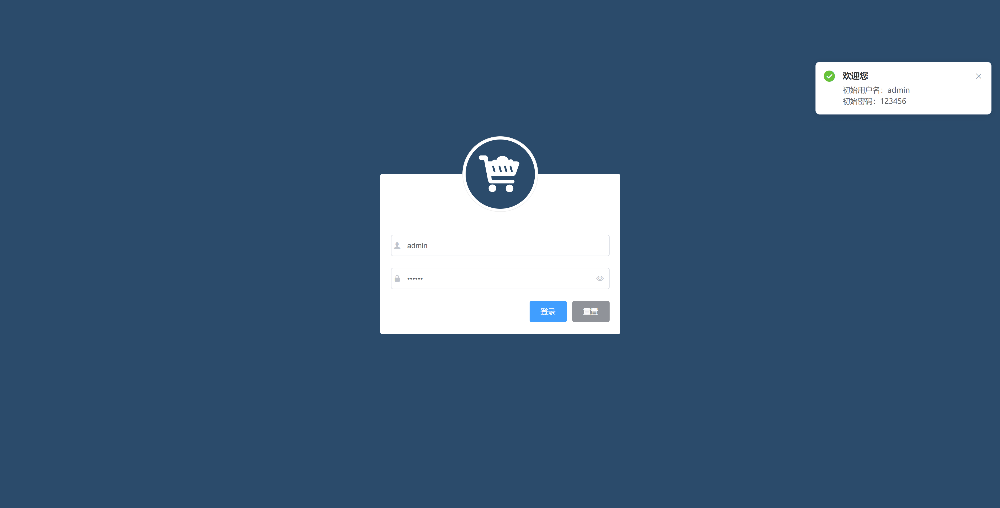

## 电商后台管理系统  [预览](http://120.53.120.229:1921/#/login)

## 前端项目(当前)  [预览](https://gitee.com/penggang-home/shopping-system)

## 后端项目 [预览](https://gitee.com/penggang-home/vue_shop_api_server)

## 电商数据可视化服务器 [预览](https://gitee.com/penggang-home/koa_server)

## API接口文档 [预览](./API接口文档.md)

## 数据库文件 [点击下载SQL文件](https://gitee.com/penggang-home/vue_shop_api_server/tree/master/db)
如何运行该项目？
```js
//首先你应当克隆该项目
git clone https://gitee.com/penggang-home/shopping-system.git

// 然后 安装依赖
cnpm install

// 接下来 访问线上项目
npm run serve

```

## 一、项目介绍
  该项目是基于 Vue和ElementUI组件库 搭建的一个后台管理系统，能实现管理用户账号，商品分类，商品信息，订单，通过Echarts实现了不同商家、不同地区的销售数据可视化

  
## 二、开发模式

电商后台管理系统整体采用前后端分离的开发模式,其中前端项目是基于Vue技术栈的SPA项目

## 三、技术栈

前端项目技术栈
- Vue
- Vue-router
- Element-UI
- Axios
- Echarts
- ES6 / ES7


后端项目技术栈
- Node.js
- Express
- Jwt
- Mysql
- Sequelize

## 四、项目预览

#### 4.1 登录界面


#### 4.2 欢迎页面


#### 4.3 用户管理


#### 4.4 角色列表


#### 4.5 权限列表


#### 4.6 商品列表


#### 4.7 分类参数


#### 4.8 商品分类


#### 4.9 订单管理


#### 4.10 数据可视化页面 黑色主题


#### 4.11 数据可视化页面 亮色主题


#### 4.12 热销商品占比


#### 4.13 商家分布


#### 4.14 地区销量趋势


